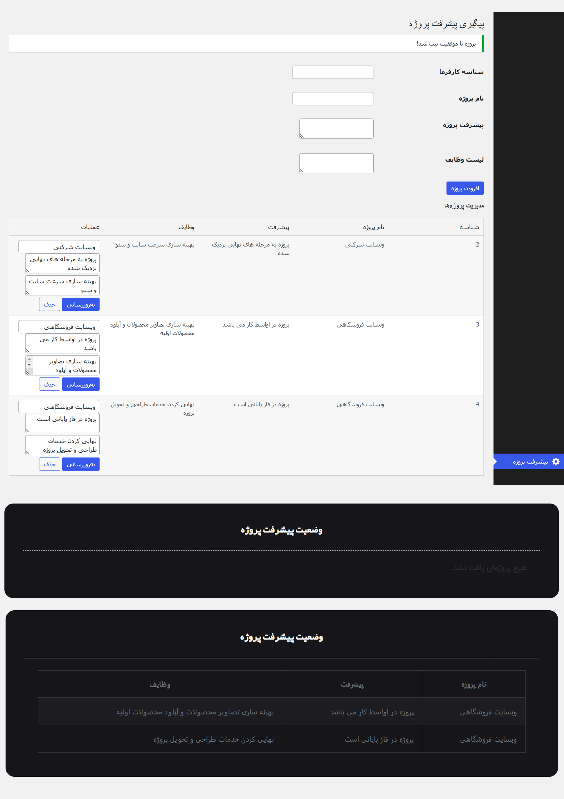

# پلاگین مدیریت پیشرفت پروژه

پلاگین مدیریت پیشرفت پروژه برای وردپرس به شما کمک می‌کند تا به سادگی و به طور کارآمد پروژه‌های خود را مدیریت و پیگیری کنید و برای کارفرما در پنل کاربری ، وضعیت پیشرفت پروژه رو نمایش دهید.

## درباره این پروژه

به پلاگین جامع مدیریت پیشرفت پروژه خوش آمدید. این پلاگین به گونه‌ای طراحی شده که تجربه کاربری بی‌نقص و کارآمدی را برای مدیریت پروژه‌ها فراهم کند. مراحل زیر را دنبال کنید تا با ویژگی‌های پلاگین آشنا شوید:

1. **اطلاعات پایه:**
   - اطلاعات کلی پروژه خود را وارد کنید، شامل نام پروژه، توضیحات و مهلت‌های زمانی. این اطلاعات به شما کمک می‌کند تا یک نمای کلی از پروژه داشته باشید.

2. **تخصیص وظایف:**
   - وظایف مختلف را به اعضای تیم تخصیص دهید. 

3. **پیگیری پیشرفت:**
   - پیشرفت هر وظیفه را پیگیری کنید و گزارش‌های دقیق از وضعیت پروژه را به کارفرما ارئه دهید . این ابزار به شما کمک می‌کند تا کارفرما را از هر مرحله مطلع کنید.

4. **نمایش گرافیکی:**
   - اطلاعات پیشرفت پروژه‌ها به صورت جدول نمایش داده می‌شود. این ابزارها به شما کمک می‌کنند تا به سادگی وضعیت پروژه را در پنل کاربری یا هر قسمت دیگر سایت نمایش دهید.

## ویژگی‌های پلاگین

1. **فرم‌های ورودی برای اطلاعات پروژه:**
   - شامل شناسه کاربران، نام پروژه، پیشرفت پروژه، و لیست وظایف است.
   
2. **جدول نمایش اطلاعات پروژه‌ها:**
   - این جدول شامل ستون‌های شناسه، نام پروژه، پیشرفت، وظایف و عملیات است.

3. **دکمه‌های "ویرایش/نمایش" و "حذف" برای هر پروژه:**
   - امکان ویرایش یا حذف پروژه‌ها را فراهم می‌کند.

4. **بخش وضعیت پیشرفت پروژه‌ها:**
   - در پایین صفحه، وضعیت پیشرفت پروژه‌ها نمایش داده شده است و شما میتوانید با استفاده از کد کوتاه در هر قسمتی از سایت خود که دوست دارید به نمایش بگذارید.

## نحوه استفاده از پلاگین 
پس از دانلود فایل زیپ پلاگین پلاگین را در وردپرس خود نصب کنید و پلاگین آماده استفاده است و گر خواستید روند پروژه را بصورت یک جدول به کاربر نمایشد دهید کافیست کد کوتاه   [project_progress]    هرجایی و در هر صفحه ای که 
میخواهید در آن نمایش داده شود جای گذاری کنید و به کاربر نمایش دهید 

## دانلود پلاگین 
برای دانلود فایل پلاگین روی دانلود فایل کلیک کنید
 [دانلود فایل](https://github.com/Ahankar/project-progress-tracker/blob/main/project-progress-tracker%20v2.zip)

## مهارت‌های به‌کار رفته در این پروژه

## پیش‌نمایش
 <!-- لینک تصویر پیش‌نمایش پلاگین -->
